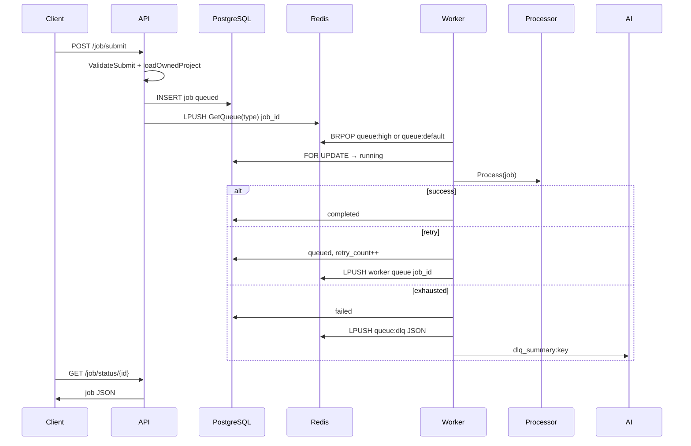
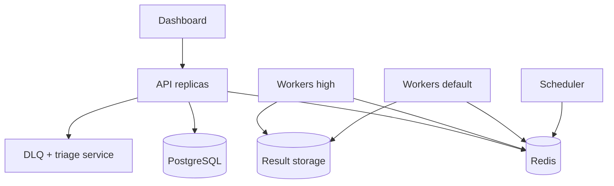

# Jobqueue — System Architecture

This document describes what **jobqueue** is, how it works after **Phase 1** (functional core), what remains open, and the longer-term vision.

**Last updated:** Phase 1 complete — unified queues, canonical job types, project API, submit auth, validation, tests compile.

---

## 1. What this project is

**Jobqueue** is a Go-based **background job processing service**: clients submit work over HTTP, jobs are persisted in **PostgreSQL**, queued in **Redis**, processed by **worker pools**, and tracked per **project** under a **user** account (API key auth).

It is a self-hosted alternative to pieces of Sidekiq / Bull / Celery, with a planned differentiator: **intelligent DLQ operations** (failure diagnosis, triage, replay) — see §12.

| Capability | Status |
|------------|--------|
| User registration & API-key auth | Done |
| Project create & list | Done (Phase 1) |
| Submit job, status, list by project | Done |
| Submit validation & project ownership | Done (Phase 1) |
| Redis queues aligned with worker pools | Done (Phase 1) |
| Canonical job types (`send_email`, etc.) | Done (Phase 1) |
| Retries & DLQ push (Redis) | Done in worker |
| Task processors (email, receipt PDF, summarize) | Mock / local PDF |
| Autoscaling workers, reaper, Prometheus | Done |
| DLQ management API, results store, UI | Not started |
| Scheduled jobs (`ExecuteAt`) | Model only |
| README, `.env.example`, full Docker stack | Partial (`.env` local only) |

**Module:** `jobqueue` (Go 1.23+). **Entry:** `cmd/server` — single process runs API + all worker pools.

**UI:** `ui/` has placeholder React components only; no Next.js app.

---

## 2. Problem statement & use cases

### Problems it solves

- Decouple HTTP latency from slow work (email, PDFs, summarization).
- Persist job state, retry failures, isolate permanent failures in a DLQ.
- Expose queue/worker metrics (Prometheus).
- Isolate workloads per **project** per **user**.

### Supported job types (API + processors)

| Type | Queue | Processor | Behavior today |
|------|-------|-----------|----------------|
| `send_email` | `queue:high` | `MockEmailSender` | Simulated SMTP; ~50% random failure for retry testing |
| `generate_receipt` | `queue:default` | `ReceiptGenerator` | Writes `receipt-{jobID}.pdf` locally |
| `summarize_text` | `queue:default` | `MockSummarizer` | Log-only mock |

Defined in `internal/config/constants.go`, validated in `internal/jobs/validator.go`, routed in `internal/heuristics/router.go`.

---

## 3. Running locally

### Prerequisites

- Go 1.23+
- PostgreSQL
- Redis

### Environment (`.env` in `jobqueue/`)

```env
POSTGRES_DSN=host=localhost user=postgres password=pass dbname=jobqueue port=5432 sslmode=disable
REDIS_URL=redis://localhost:6379/0
PORT=8080
```

Loaded via `godotenv` in `internal/config/env.go`.

### Start server

```bash
cd jobqueue
go run ./cmd/server
```

Auto-migrates `users`, `projects`, `jobs` on startup.

### Minimal API flow

```text
POST /api/v1/register          → api_key
POST /api/v1/projects          → project id   (Bearer api_key)
POST /api/v1/job/submit        → job id       (project_id, type, payload)
GET  /api/v1/job/status/{id}
GET  /api/v1/job/list?projectID=
GET  /api/v1/projects
```

---

## 4. Current architecture

### 4.1 Component diagram

```mermaid
flowchart TB
    subgraph clients [Clients]
        HTTP[HTTP / curl]
        UI[UI - not built]
    end

    subgraph api_layer [cmd/server - API]
        Router[chi Router]
        Auth[API Key + Rate Limit]
        H[Register / Login / Projects / Jobs]
        Val[jobs.ValidateSubmit]
    end

    subgraph storage [Storage]
        PG[(PostgreSQL)]
        Redis[(Redis)]
    end

    subgraph workers_layer [Workers - same process]
        PoolHigh[Pool queue:high]
        PoolDef[Pool queue:default]
        Scale[Autoscaler]
        Reaper[Reaper]
    end

    subgraph tasks_layer [tasks.Processor]
        E[send_email]
        R[generate_receipt]
        S[summarize_text]
    end

    subgraph obs [Observability]
        Prom[/metrics]
        AI[DLQ AI summary stub]
    end

    HTTP --> Router
    UI -.-> Router
    Router --> Auth --> H
    H --> Val
    H --> PG
    H -->|LPUSH job UUID| Redis

    PoolHigh & PoolDef -->|BRPOP| Redis
    PoolHigh & PoolDef --> PG
    PoolHigh & PoolDef --> tasks_layer
    Scale --> PoolHigh & PoolDef
    Reaper --> PG
    Reaper -->|LPUSH job UUID| Redis
    workers_layer --> Prom
    workers_layer --> AI
    AI --> Redis
```

### 4.2 Submit → process → complete



### 4.3 Queue routing (implemented)

`heuristics.GetQueue(jobType)`:

| Job type | Redis list | Worker pool (`main.go`) |
|----------|------------|-------------------------|
| `send_email` | `queue:high` | `NewPool(..., "queue:high", ...)` |
| `generate_receipt`, `summarize_text`, unknown | `queue:default` | `NewPool(..., "queue:default", ...)` |

**Redis payload:** always the job **UUID string** (API, reaper, retries). Helper `jobs.EnqueueJobID(rdb, jobType, jobID)` matches this contract.

**Retry note:** failed jobs re-`LPUSH` to the **worker pool’s queue** (`w.queue`), not re-routed through heuristics — correct for same-pool retries.

### 4.4 Repository layout

```
jobqueue/
├── cmd/server/main.go       # API + workers + autoscaler + reaper
├── internal/
│   ├── api/                 # Handlers: user, job, project; routes; loadOwnedProject
│   ├── config/              # env.go, constants.go (queues + job types)
│   ├── heuristics/          # GetQueue()
│   ├── jobs/                # validator, EnqueueJobID; dlq/results stubs
│   ├── middleware/          # auth, rate limit
│   ├── models/              # User, Project, Job
│   ├── tasks/               # Processor registry + implementations
│   ├── workers/             # pool, worker, autoscaler, reaper
│   ├── ai/                  # DLQ summary stub → Redis
│   └── monitoring/          # Prometheus metrics
├── ui/                      # Placeholder components only
├── test/                    # Package stubs (no tests yet)
├── docs/                    # This file
├── docker-compose.yml       # App; Postgres/Redis commented; Grafana/Prom broken refs
├── Dockerfile
└── .env                     # Local secrets (gitignored)
```

**Candidates for removal (no runtime use):** `internal/db/db.go`, `internal/queue/redis.go`, `deploy/k8s/`, stub `ci.yml`, stub `openapi.yaml`, `scripts/rollback.sh` — see cleanup plan in prior discussion.

---

## 5. Technology stack

| Layer | Choice |
|-------|--------|
| Language | Go 1.23+ |
| HTTP | chi v5 |
| ORM | GORM + PostgreSQL |
| Queue | Redis lists (`LPUSH` / `BRPOP`) |
| Auth | Bearer API key; bcrypt passwords |
| Rate limit | 5 req/s, burst 10 per API key |
| Logging | Zap (development in main) |
| Metrics | Prometheus `/metrics` |
| PDF | gofpdf (receipt task) |

---

## 6. Data model

### 6.1 ER diagram

```mermaid
erDiagram
    User ||--o{ Project : owns
    Project ||--o{ Job : contains

    User {
        uuid id PK
        string email UK
        string password
        string api_key UK
        timestamp created_at
    }

    Project {
        uuid id PK
        string name
        uuid user_id FK
        timestamp created_at
    }

    Job {
        uuid id PK
        string type
        jsonb payload
        string status
        timestamp execute_at
        int64 duration
        uuid project_id FK
        int max_retries
        int retry_count
        timestamps created_at updated_at
    }
```

### 6.2 Job statuses

| Value | Meaning |
|-------|---------|
| `queued` | In DB; ID on Redis (or waiting retry) |
| `scheduled` | **Unused** — `ExecuteAt` not wired |
| `running` | Worker holds row |
| `completed` | Success |
| `failed` | Max retries exceeded |

### 6.3 Redis keys

| Key | Written by | Read by | Value |
|-----|------------|---------|-------|
| `queue:high` | API, reaper, retry* | high pool workers | Job UUID |
| `queue:default` | API, reaper, retry* | default pool workers | Job UUID |
| `queue:dlq` | worker (permanent fail) | — (no API yet) | Job JSON |
| `dlq_summary:{id}` | AI helper | — (no API yet) | Text |

\*Retries use the pool’s queue name, not heuristics.

---

## 7. API surface

### Public

| Method | Path | Body / notes |
|--------|------|----------------|
| `POST` | `/api/v1/register` | `email`, `password` → `api_key` |
| `POST` | `/api/v1/login` | `email`, `password` → `api_key` |
| `GET` | `/metrics` | Prometheus |

### Protected (`Authorization: Bearer <api_key>`)

| Method | Path | Description |
|--------|------|-------------|
| `POST` | `/api/v1/projects` | `{"name":"..."}` → project |
| `GET` | `/api/v1/projects` | List caller’s projects |
| `POST` | `/api/v1/job/submit` | `project_id`, `type`, `payload` — validated types, owned project |
| `GET` | `/api/v1/job/status/{jobID}` | Job if user owns project |
| `GET` | `/api/v1/job/list?projectID=` | Jobs for owned project |

### Submit validation errors (400)

- `project_id is required`
- `type is required`
- `unknown job type` — not in `AllowedJobTypes`
- `payload is required`

### Not implemented

- DLQ list / inspect / requeue / delete
- Job results / artifact download API
- Project delete / update
- WebSocket / SSE
- Scheduled jobs API
- Idempotency keys on submit

---

## 8. Worker subsystem

### 8.1 Pools

- `queue:high`: min 1, max 10 workers
- `queue:default`: min 1, max 10 workers
- Each worker: `BRPOP` (5s timeout) → `processJob`

### 8.2 Guarantees

- Row lock before `running`
- Skip if status ≠ `queued` (idempotency)
- Retry: `retry_count++`, same pool queue
- DLQ: full job JSON + optional AI summary key

### 8.3 Autoscaler

Every 5s: scale up if `LLEN > 20`, down if `< 5`.

### 8.4 Reaper

Every 5m: `running` + `updated_at` > 1h ago → `queued` + `LPUSH` via `heuristics.GetQueue(type)`.

### 8.5 Registering new task types

1. Add constant to `config/constants.go` and `AllowedJobTypes`
2. Implement `tasks.Processor`
3. `tasks.Register(...)` in `cmd/server/main.go`
4. Map queue in `heuristics.GetQueue` if not default

---

## 9. Security model

| Concern | Status |
|---------|--------|
| Authentication | Bearer API key |
| Passwords | bcrypt |
| Project authorization | **All** job routes + submit use `loadOwnedProject` |
| Rate limiting | Per API key |
| TLS | Expected at reverse proxy |

---

## 10. Observability

### Prometheus (`jobqueue_*`)

`jobs_processed_total`, `job_failures_total`, `jobs_reaped_total`, `job_duration_seconds`, `workers_active`, `queue_length`.

### Grafana / Compose

`grafana.json` exists; `docker-compose.yml` references missing `prometheus.yml` and Grafana provisioning — optional for local dev.

---

## 11. Remaining gaps (post–Phase 1)

| Area | Gap |
|------|-----|
| **DLQ** | Redis list only; `jobs/dlq.go` stub; no HTTP API |
| **Results** | `jobs/results.go` stub; PDFs written to CWD only |
| **Scheduled jobs** | `StatusScheduled` / `ExecuteAt` unused |
| **UI** | Placeholder components |
| **Tests** | `test/api_test.go`, `test/worker_test.go` stubs; no HTTP integration tests |
| **Docs / ops** | No README, `.env.example`; compose incomplete |
| **Dead code** | `internal/db`, `internal/queue` unused duplicates |
| **Vision features** | AI triage product, fingerprints, job chains — not built |

Phase 1 fixed: queue mismatch, job type mismatch, submit auth, missing project API, broken `enqueue_test.go`.

---

## 12. Vision — what makes this more than a queue

Most queues treat the DLQ as a graveyard. **Jobqueue’s direction:** failure as a first-class operational experience.

| Feature | Description |
|---------|-------------|
| **Intelligent DLQ** | Structured failure events + LLM diagnosis + replay from API/UI |
| **Failure fingerprints** | Group “same root cause” failures across jobs |
| **Per-project failure trends** | Rate and type breakdown over time |
| **Job chains** | `parent_job_id` for multi-step workflows |
| **Per-project quotas** | Concurrency / rate limits at worker level |
| **Retry strategies** | Per-type backoff (exponential, fixed, none) |
| **Scheduler** | Wire existing `ExecuteAt` field |

**Tagline:** *Background jobs that tell you when they're sick and why.*

### Target architecture (future)



---

## 13. Roadmap

| Phase | Status | Work |
|-------|--------|------|
| **0** | Pending | Delete dead/stub files (k8s, rollback, duplicate db/queue, stub CI) |
| **1** | **Done** | Queues, types, project API, submit auth, validator, tests |
| **2** | Next | DLQ in Postgres + HTTP API; `jobs/dlq.go` |
| **3** | Planned | AI triage, failure fingerprints, trends API |
| **4** | Planned | Next.js UI (submit, list, DLQ panel) |
| **5** | Planned | Scheduler, retry strategies, job chains, quotas |
| **6** | Planned | README, `.env.example`, working compose, CI |

---

## 14. Design principles

1. **Postgres = source of truth** for job state; Redis = transport.
2. **Idempotent workers** — safe to re-deliver same job ID.
3. **Fail closed on auth** — every route touching a project checks ownership.
4. **One job type namespace** — `config` + `tasks.Register` + API validator + heuristics.
5. **One Redis payload shape** — job UUID only on work queues.
6. **DLQ is first-class** (target) — not a hidden Redis list.
7. **Observability by default** — metrics on queues, workers, durations, failures.

---

## 15. Configuration

| Variable | Required | Default |
|----------|----------|---------|
| `POSTGRES_DSN` | Yes | — |
| `REDIS_URL` | Yes | — |
| `PORT` | No | `8080` |

---

## 16. Summary

| Question | Answer |
|----------|--------|
| **What is it?** | Multi-tenant Go job queue: HTTP API, Postgres, Redis, in-process workers. |
| **What works end-to-end?** | Register → create project → submit (`send_email` etc.) → worker processes → status/list. |
| **What’s next?** | DLQ API, intelligent failure UX, UI, scheduler, ops polish. |
| **Differentiator?** | Operational failure experience (diagnose, group, triage, replay) — not just enqueue/dequeue. |

---

## 17. Related files

| File | Status |
|------|--------|
| `docs/openapi.yaml` | Stub |
| `CONTRIBUTING.md` | Stub |
| `internal/monitoring/grafana.json` | Present |
| `deploy/k8s/secrets.yaml` | Stub — candidate for removal |
